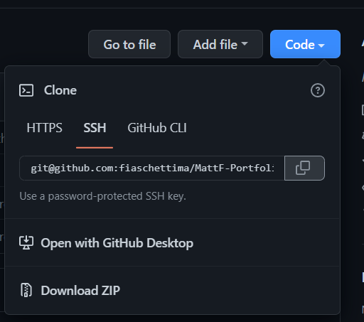
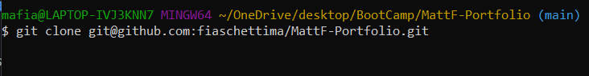

# MattF-Portfolio

## Description

This project is a general layout for a basic porfolio for developers. Its designed to highlight important information about the developer and showcase some of their most noteworthy projects completed to date. Also, giving the viewer or potential client a chance to get in touch with you or keep up with your social media. All of this will enable the ability to easily advertise yourself to employer or potentially have employers find you and reach out after seeing what your able to create.
    
[Link to the Live webpage](https://fiaschettima.github.io/MattF-Portfolio/)

---
## Table of Contents

Here's a few quick links:

* [Installation](#installation)
* [Usage](#usage)
* [Credits](#credits)
* [License](#license)
---

## Installation

To download the raw code of the page follow the steps below:
1. In the Mattf-portfolio Repository copy the Code  
2. Open your version of terminal and enter > git clone git@github.com:fiaschettima/MattF-Portfolio.git 
3. After that the code is now on your local machine and you are free to copy it to your own repository and make changes

---
## Usage 

Hopefully this can be used to create a base for your own portfolio design and bring in some projects

## Credits

- [Link to Social Media icon source](https://www.iconfinder.com/)
- [W3 Scools](https://www.w3schools.com/)

---
## License

MIT License